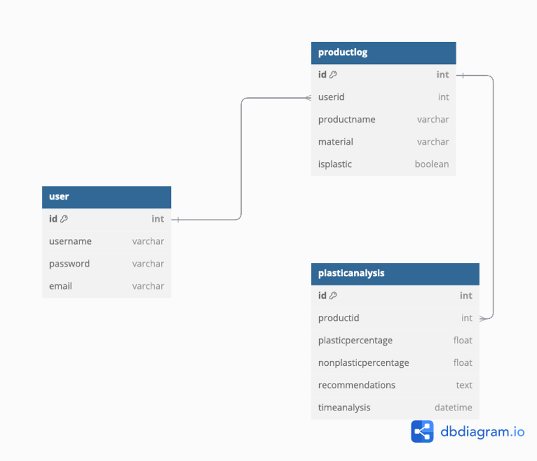
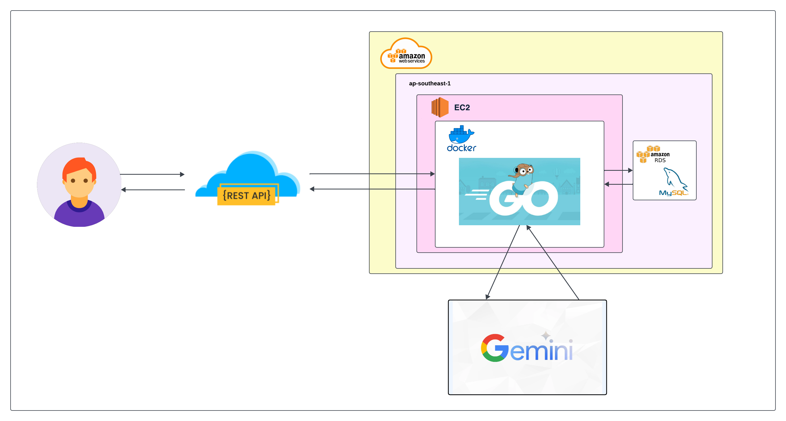

# Clean & Green

Clean & Green adalah aplikasi yang memantau konsumsi produk berbahan plastik atau bebas plastik. Dalam aplikasi ini pengguna akan memasukkan daftar produk yang mereka konsumsi setiap hari, termasuk informasi mengenai bahan dari produk tersebut. Aplikasi ini dibangun menggunakan **Golang** dengan arsitektur RESTful API.

---

## 1. Entity Relationship Diagram (ERD)

Berikut adalah ERD untuk aplikasi EcoBite:


ERD ini menunjukkan struktur data untuk aplikasi "Clean & Green" yang membantu pengguna mencatat produk yang mereka konsumsi dan menganalisis dampak konsumsi plastik. Struktur ini memungkinkan:

- Pengguna (user) untuk mencatat berbagai produk (productlog) yang mereka konsumsi, termasuk bahan produk tersebut.
- Analisis Konsumsi Plastik (plasticanalysis) dapat dilakukan pada setiap produk untuk memberikan wawasan tentang persentase plastik yang digunakan serta memberikan rekomendasi produk alternatif bebas plastik.

---

## 2. High-Level Architecture (HLA)



Komponen Utama dari Arsitektur Aplikasi Ini Meliputi:
- **Backend API**: Server RESTful yang ditulis dalam Golang menggunakan framework Echo untuk menangani proses bisnis, autentikasi pengguna, dan pengelolaan data produk serta analisis konsumsi plastik.
- **Database**: Penyimpanan data terstruktur menggunakan MySQL yang di-hosting di Amazon RDS untuk skalabilitas dan pemeliharaan yang mudah. Menyimpan data pengguna, catatan produk, dan hasil analisis konsumsi plastik.
- **External Services**: Menggunakan Gemini API untuk memberikan rekomendasi produk alternatif bebas plastik, serta integrasi dengan layanan lain untuk fitur AI. Seperti AI untuk deskripsi produk.

---

## 3. Cara Instalasi dan Penggunaan

### Prasyarat

- Golang
- Database (MySQL atau PostgreSQL)
- Alat pendukung seperti Postman untuk pengujian API

### Langkah Instalasi

1. Clone repositori:

```
git clone https://github.com/jasminearta/YasmineArtamevia_Golang_MiniProject.git
```

2. Install Depedencies

```
go mod tidy
```

3. Contoh env

```
DATABASE_HOST = ""
DATABASE_USER = ""
DATABASE_PASSWORD = ""
DATABASE_PORT = ""
DATABASE_NAME = ""
JWT_SECRET=""
GEMINI_API_KEY= ""
```

4. Run app

```
go run main.go
```
```